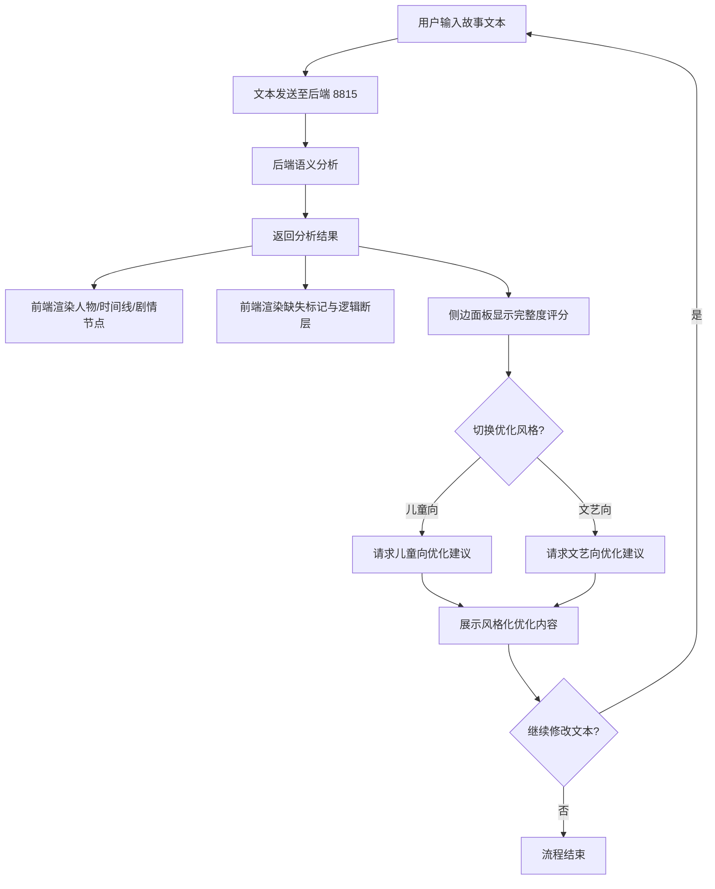

## 1. 产品概述

故事语义分析工作台——一款面向创作者的在线文本分析工具，帮助用户快速梳理短篇故事的人物关系、时间线与关键剧情节点，自动识别剧情缺失与逻辑断层，并给出补充方向建议。支持儿童向、文艺向两种优化风格切换，修改文字后实时刷新分析结果。

- 目标用户：短篇故事写作者、文学爱好者、创意写作教学者
- 核心价值：降低故事创作中的结构梳理门槛，通过 AI 语义分析提升故事完整度与逻辑连贯性

## 2. 核心功能

### 2.1 功能模块

1. **编辑工作台页面**：文案输入文本框、实时语义分析结果展示、侧边完整度评分面板、优化风格切换

### 2.2 页面详情

| 页面名称 | 模块名称 | 功能描述 |
|----------|----------|----------|
| 编辑工作台 | 文案输入区 | 大文本框录入短篇故事，支持粘贴/手动输入，输入内容实时同步至后端分析 |
| 编辑工作台 | 语义分析结果区 | 展示 AI 梳理的人物列表（含角色关系）、时间线、关键剧情节点；标记剧情缺失段落与逻辑断层，给出补充方向建议 |
| 编辑工作台 | 侧边评分面板 | 展示故事完整度评分（0-100）、各维度得分（人物饱满度、剧情连贯性、时间线完整性、逻辑自洽度）；支持儿童向/文艺向风格切换 |
| 编辑工作台 | 风格优化区 | 切换儿童向/文艺向后，展示对应风格的优化建议与改写片段 |

## 3. 核心流程

用户在文本框录入短篇故事 → 文本发送至后端语义分析 API → 后端返回人物、时间线、剧情节点、缺失标记、逻辑断层、完整度评分 → 前端实时渲染分析结果与评分面板 → 用户切换优化风格 → 后端返回对应风格优化建议 → 前端展示优化内容 → 用户继续修改文本，循环以上流程

## 4. 用户界面设计

### 4.1 设计风格

- 主色调：深墨绿 (#1a2f23) 搭配暖米白 (#faf6f0)，营造书卷气质
- 强调色：琥珀金 (#d4a853) 用于评分、高亮标记
- 辅助色：柔红 (#c45c5c) 用于缺失/断层警示标记
- 字体：标题使用 Noto Serif SC（衬线，文艺感），正文使用 Noto Sans SC
- 布局：左主右侧边栏，主区域分上下（输入区 + 分析区），侧边栏固定评分与风格切换
- 交互：文本变化防抖后自动请求分析，风格切换即时刷新

### 4.2 页面设计概览

| 页面名称 | 模块名称 | UI 元素 |
|----------|----------|---------|
| 编辑工作台 | 文案输入区 | 深色背景文本框，左上角标题"故事文本"，右下角字数统计，输入时微光边框动画 |
| 编辑工作台 | 语义分析结果区 | 卡片式分区展示：人物卡片（头像占位+名称+关系线）、时间线（横向节点轴）、剧情节点（折叠卡片）、缺失/断层标记（红色高亮行内标注+补充方向气泡） |
| 编辑工作台 | 侧边评分面板 | 固定右侧栏，顶部总评分圆环动画，四维度进度条，下方风格切换按钮组（儿童向/文艺向），底部优化建议滚动区 |
| 编辑工作台 | 风格优化区 | 风格切换后，优化建议以对比卡片形式呈现：原文 vs 优化文，差异高亮 |

### 4.3 响应式

桌面优先设计，最小支持 1024px 宽度；窄屏时侧边栏折叠为底部抽屉

### 4.4 3D 场景

不适用
