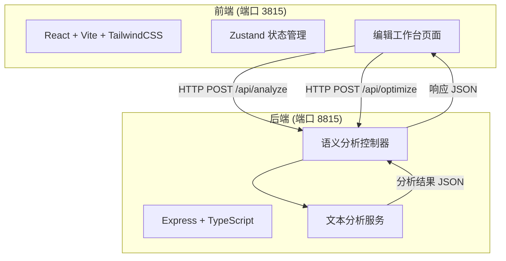

## 1. 架构设计



## 2. 技术说明

- 前端：React@18 + TailwindCSS@3 + Vite + Zustand
- 初始化工具：vite-init
- 后端：Express@4 + TypeScript（ESM 格式）
- 数据库：无（纯在线文本交互，不持久化）
- 端口：前端 3815，后端 8815

## 3. 路由定义

| 路由 | 用途 |
|------|------|
| / | 编辑工作台主页面 |

## 4. API 定义

### 4.1 语义分析接口

**POST /api/analyze**

请求体：
```typescript
interface AnalyzeRequest {
  text: string;
}
```

响应体：
```typescript
interface AnalyzeResponse {
  characters: {
    name: string;
    role: string;
    relationships: string[];
  }[];
  timeline: {
    event: string;
    order: number;
  }[];
  plotNodes: {
    title: string;
    description: string;
    type: "climax" | "turning_point" | "resolution" | "exposition";
  }[];
  gaps: {
    position: string;
    type: "missing_plot" | "logic_gap";
    description: string;
    suggestion: string;
  }[];
  score: {
    overall: number;
    characterDepth: number;
    plotCoherence: number;
    timelineCompleteness: number;
    logicalConsistency: number;
  };
}
```

### 4.2 风格优化接口

**POST /api/optimize**

请求体：
```typescript
interface OptimizeRequest {
  text: string;
  style: "children" | "literary";
  gaps?: AnalyzeResponse["gaps"];
}
```

响应体：
```typescript
interface OptimizeResponse {
  style: "children" | "literary";
  suggestions: {
    original: string;
    optimized: string;
    reason: string;
  }[];
}
```

## 5. 服务器架构图


## 6. 数据模型

无持久化数据模型，所有分析结果基于请求文本实时计算返回。
